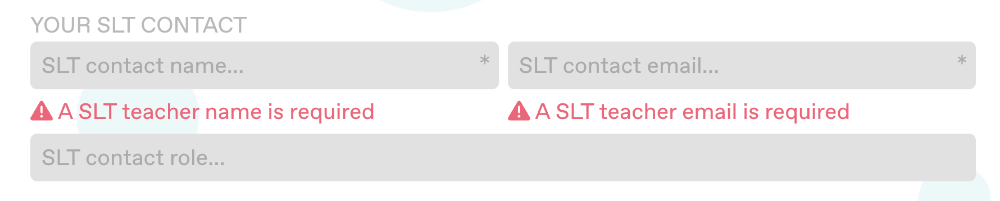

This is the July 17th 2023 ootiboo Digital Platform update.

--- 

## ❗ Important notices ❗

- The *Tabbed Content* block has been deprecated. Instead, please use the revised and improved *Collapsibles* block (same functionality as the *Tabbed Content* block + new features (see below)). Old instances of the *Tabbed Content* block will still be displayed correctly.

--- 

## 🚀 New Features 🚀

##### Strapi component titles

To make working with dyn. block components in Strapi easier and more comfortable, all dynamic blocks now feature a *Title* field, the content of which will be displayed in the title of the Strapi component, making it easy to identify (without their own titles, blocks need to be opened to be identified).

##### Dynamic component library

Documentation for all currently available dynamic blocks can be found here: …

I've started moving my notes on functionality and usage of the different blocks to this repository and will continue to do so. This will make it easier and faster to answer questions on how to use these Strapi components and to onboard people unfamiliar with the ootiboo Strapi setup (e.g. new content editors).

## ✂️ Revisions ✂️

### Teacher sign-up form

- The SLT contact name and email fields of the teacher sign-up form are now required in order 
to submit the form (an error message will be displayed informing the user about the missing information)

---

## 🛠️ Fixes 🛠️

### Image Gallery Block

A new iteration of the _Gallery_ block has been implemented in the effort to solve visual glitches and jumps occurring when navigating through the images of previous implementations.

The new implementation is integrated with the Strapi block labelled *Block Gallery (PROTO)* and the *Block Tabbed Content* component (when adding gallery images inside a tab).

Note: All images added to the new _Gallery_ block are labelled *Image* by default (via the *Title* field); any other title will be displayed as this image's caption below the gallery.

##### Image loading indicator

The revised Slider component inside the *Gallery* block also features a loading indicator. This improves the user experience while viewing the site with a slow internet connection or on pages with larger image files by informing the user that an image is still being loaded, i.o. displaying a blank space (which can be mistaken for an error).

---

## 🧹 Cleanup 🧹

- Old implementations of the Gallery/Slideshow component have been removed from the codebase
- User profile routes have been cleaned up to prevent code duplication, divergences and subsequent errors
