This is the July 19th 2023 ootiboo Digital Platform update.

## 🚀 New Features 🚀

### Strapi component titles

To make working with dyn. block components in Strapi easier and more comfortable, all dynamic blocks now feature a *Title* field, the content of which will be displayed in the title of the Strapi component, making it easy to identify (without their own titles, blocks need to be opened to be identified).

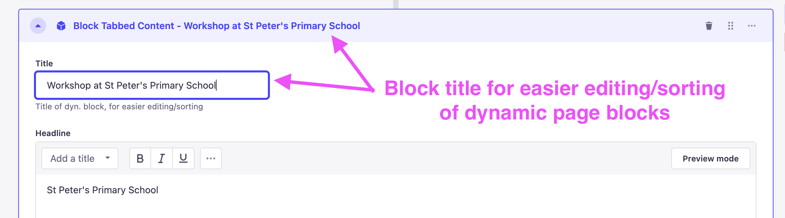
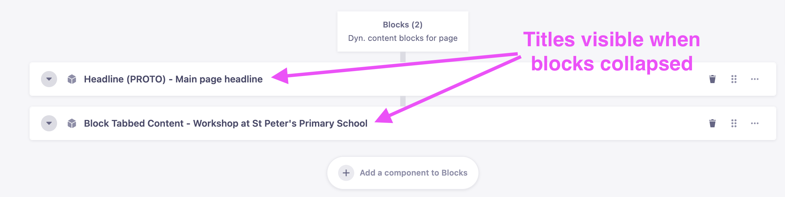

### New content features for *Tabbed Content* block

The *Tabbed Content* block now features an optional nested *Quote* block and *Call-to-Action* button. 

The *Quote* block field sits below the *»Read more« Text* field. It must be filled in with a *text* and a *name*. The name is optional, the block will render even if none is provided. 

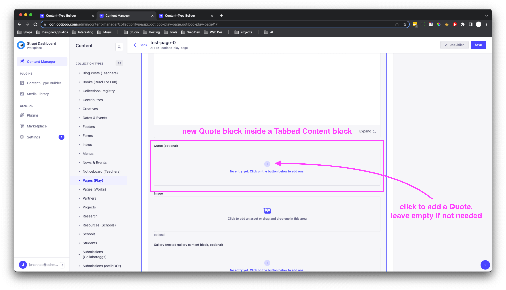
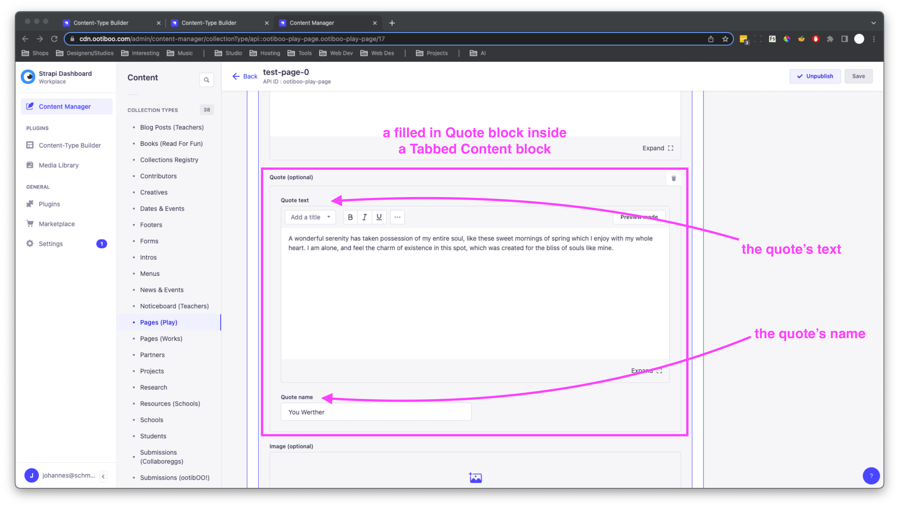

The *Call-to-Action* button field sits at the very end of the *Tabbed Content* block.

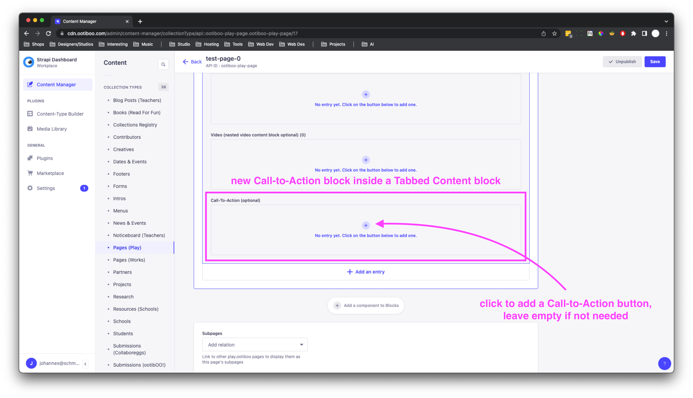
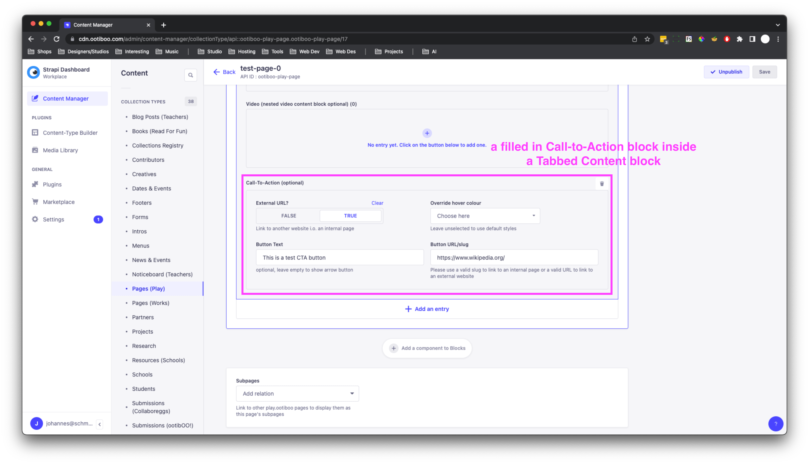

Frontend example of a *Quote* and *Call-to-Action* block inside a *Tabbed Content* block:

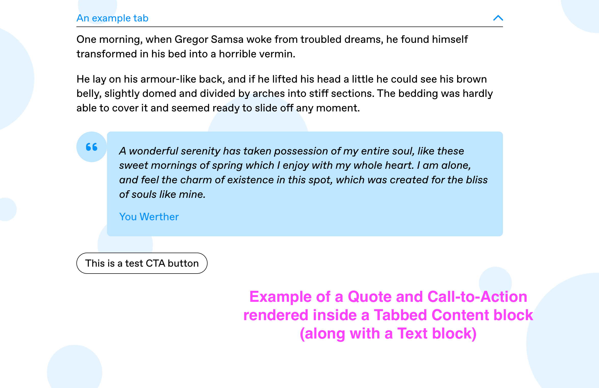

Please Note: 

Due to the limitations Strapi puts on how content can be nested inside a component (what we refer to as *blocks* is technically called a *component* in Strapi), the content fields inside a block are fixed. This means their order cannot change and they cannot be created dynamically like the blocks themselves.
The currently available fields inside a _Tabbed Content_ block and their order are:

- a Text block (w/ optionally »more« text)
- a Quote block
- a single image
- a Gallery block
- a Video block
- a Call-to-action button

The fields will be rendered in this order on the frontend. Empty fields fill be skipped. New fields can be added but it needs to be done by Johannes or Mark.

---

## ✂️ Revisions ✂️

### Teacher sign-up form

The SLT contact name and email fields of the teacher sign-up form are now required in order to submit the form (an error message will be displayed informing the user about the missing information).

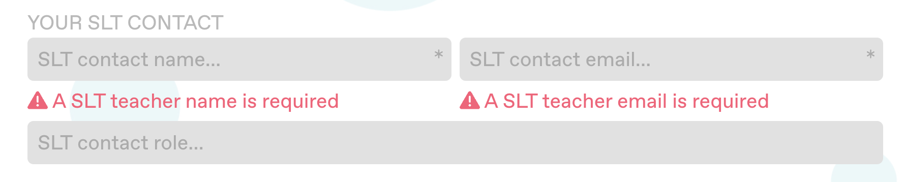

### Teacher/School profile

The Year Group card has been removed from the teacher/school profile page. The feature is no longer relevant as it is unlikely that teachers will share this information consistently. It can easily be re-integrated in case it becomes relevant in the future.

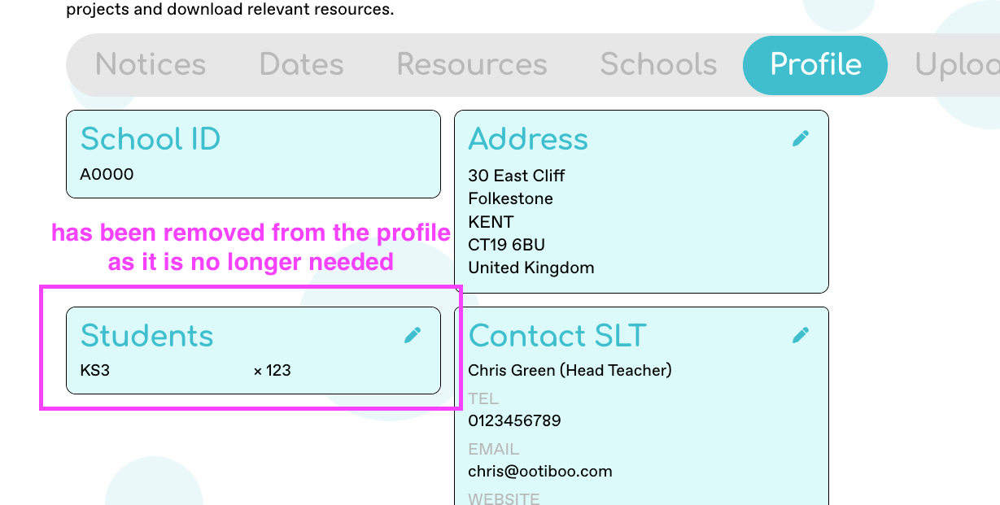

---

## 🛠️ Fixes 🛠️

### Image Gallery Block

A new iteration of the _Gallery_ block has been implemented in the effort to solve visual glitches and jumps occurring when navigating through the images of previous implementations.

The new implementation is integrated with the Strapi block labelled *Block Gallery (PROTO)* and the *Block Tabbed Content* component (when adding gallery images inside a tab).

Note: All images added to the new _Gallery_ block are labelled *Image* by default (via the *Title* field); any other title will be displayed as this image's caption below the gallery.

#### Image loading indicator

The revised Slider component inside the *Gallery* block also features a loading indicator. This improves the user experience while viewing the site with a slow internet connection or on pages with larger image files by informing the user that an image is still being loaded, i.o. displaying a blank space (which can be mistaken for an error).

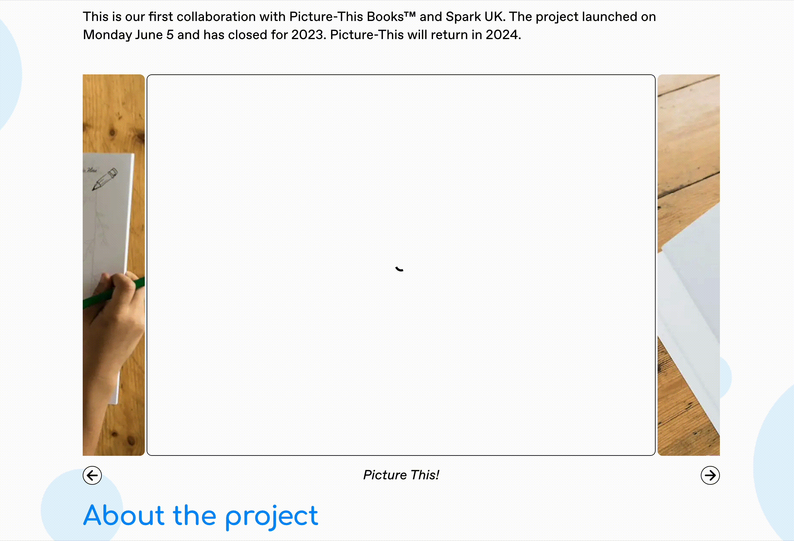

### Teacher/School Profile Contact Card

A bug has been fixed which caused the *Contact Teacher* card on the teacher/school profile page to not display the actual information (name, email, phone number).

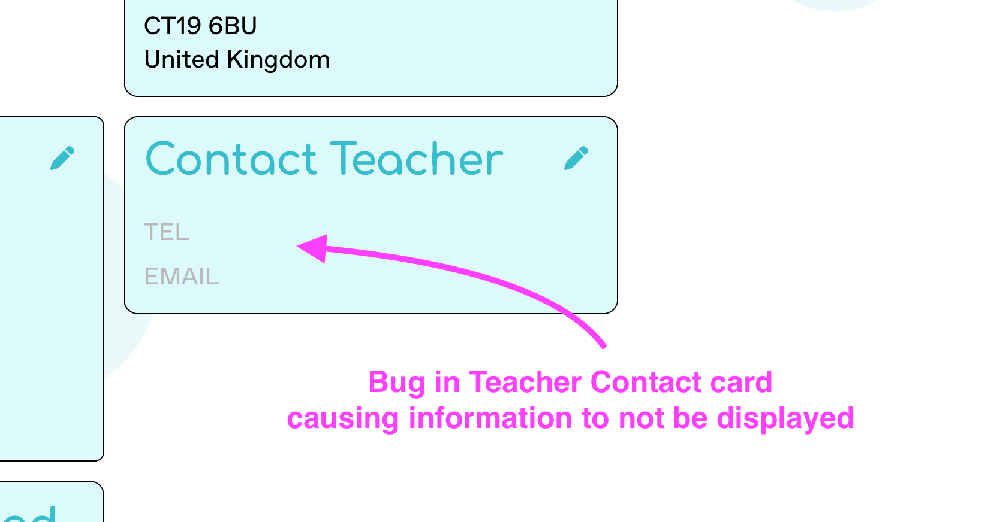
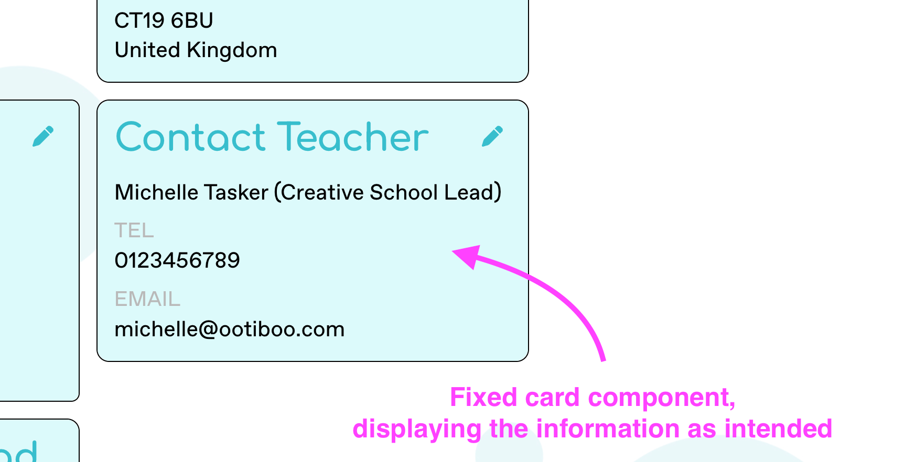

### teachers.ootiboo Navigation Link Highlighting

A bug has been fixed which caused the navigation link corresponding to the page currently being viewed to not be highlighted, in the teachers.ootiboo.com version of the application.

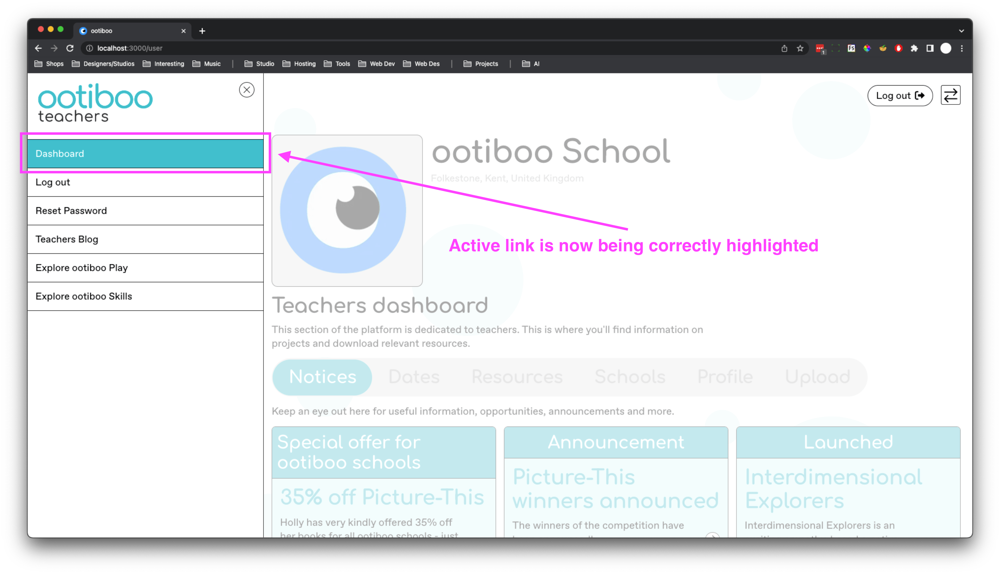

---

## 🧹 Cleanup 🧹

- Old implementations of the Gallery/Slideshow component have been removed from the codebase
- User profile routes have been cleaned up to prevent code duplication, divergences and subsequent errors
- Unused/Deprecated content block types have been removed from Strapi
