# Updt. Notes 07-26-2023

This is the July 26h 2023 ootiboo Digital Platform update.

 

## 🚀 New Features 🚀

### Event registration

Users are now able to register for dates/events.

Every entry of the *Dates & Events* collection now features a *Registrations for this event* field, containing a list of registrations, each with a mandatory *Email* field and the optional *First Name* and *Last Name* fields. 

Correspondingly, every entry features a *With registration* toggle. When set to *true*, the card rendered on the frontend for this event (on the *Dates & Events* page) will display a *Register for this event* button.

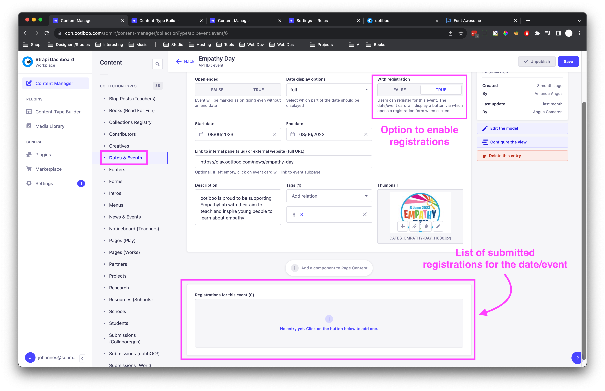
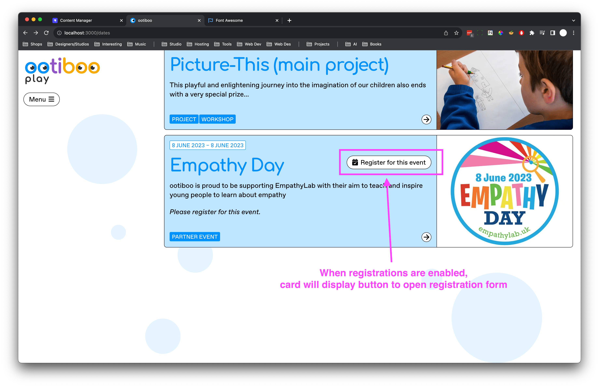

When clicked, a registration form is opened. The form feature three input fields, for *First name*, *Last name* and  *Email*. Only the email field is mandatory. If not filled out, a notification will be displayed, informing the user about needed to provide a valid email address to register.

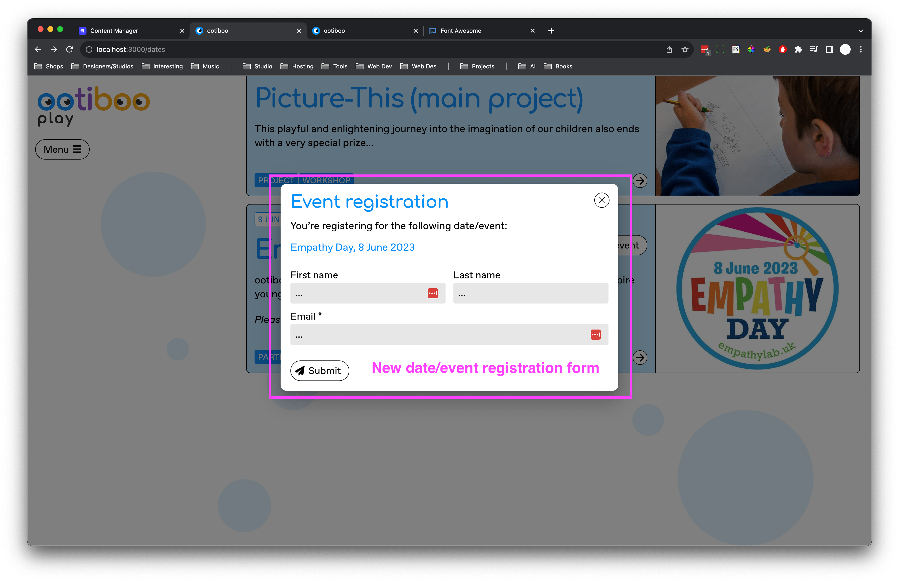
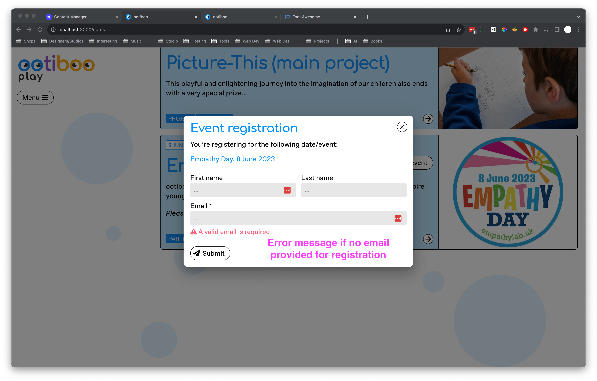

Upon submission, a registration with the submitted information is added to the *Dates/Events* entry. A loading indicator to let the user know that their registration is being processed. After the submission, a notification is displayed at the bottom of the form, informing the user about whether it was successful or not.

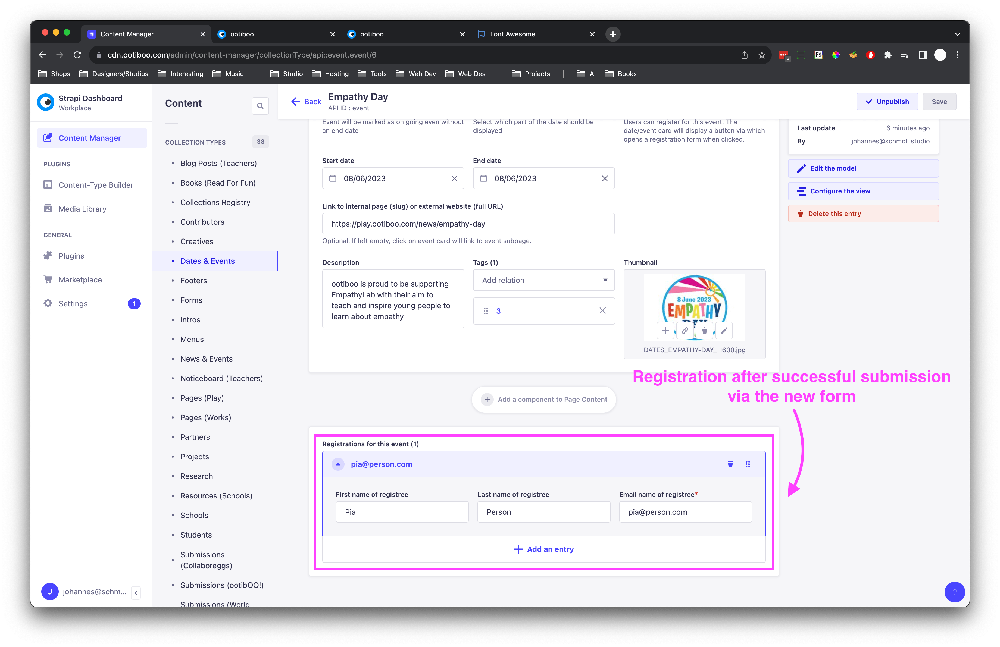

Should a user submit a registration with an email that has already been used to register for the given event, the registration will be prevented, along with a notification, letting the user know that their email has already been used.

https://github.com/joh-sch/ootiboo-Update-Notes/assets/39758027/0376ef07-0b8c-450d-802a-d7a7a1e95f78

 

### New & Manual Project Types

The types *At school* and *At home* have been added to the types available to select when creating a new entry of the *Projects* collection.

![[00-new-project-types.png]](./imgs/00-new-project-types.png)

Furthermore, the field *Type (manual)* has been added to the *Projects* collection model/blueprint. Use it in case you're setting up a project of a type not in the list of predefined types.

❗**Note**: The *Type (manual)* field takes precedence over the regular *Type* field; if it has been filled out, its content will be used as the project's type, regardless of whether a regular type has been selected or not.

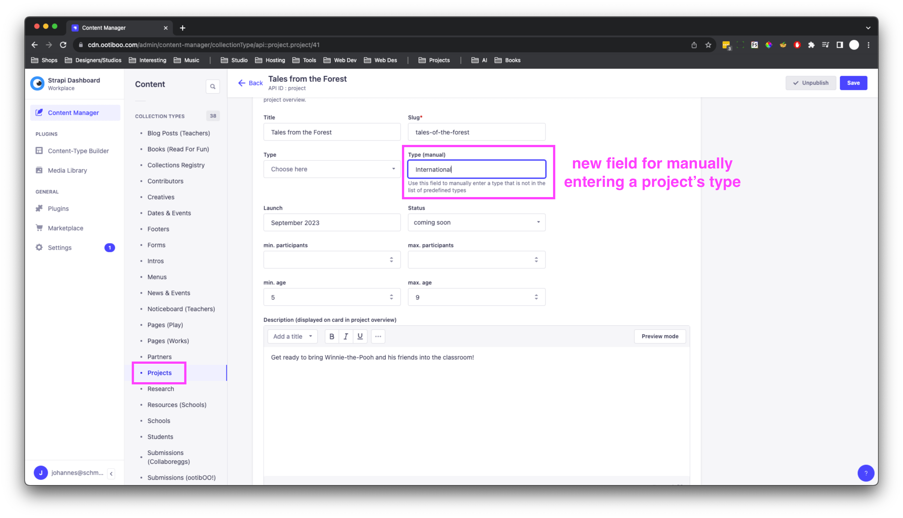

Manually created types will be rendered as tags on the project's card (overview page) and in the header of the project's page.

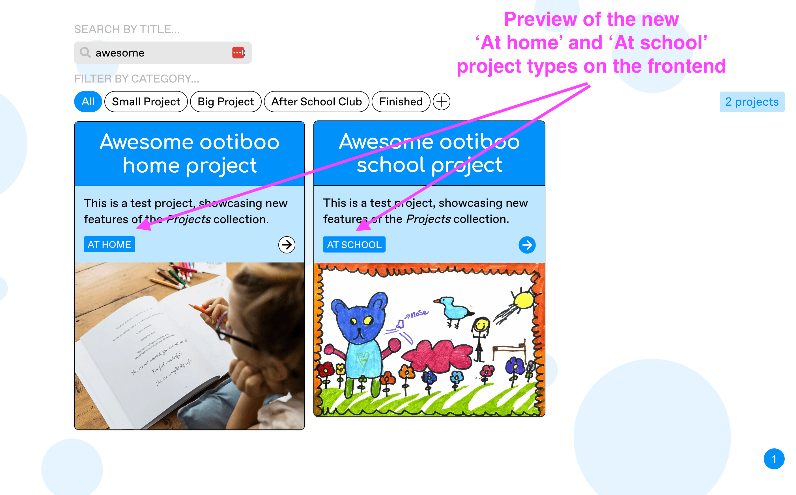

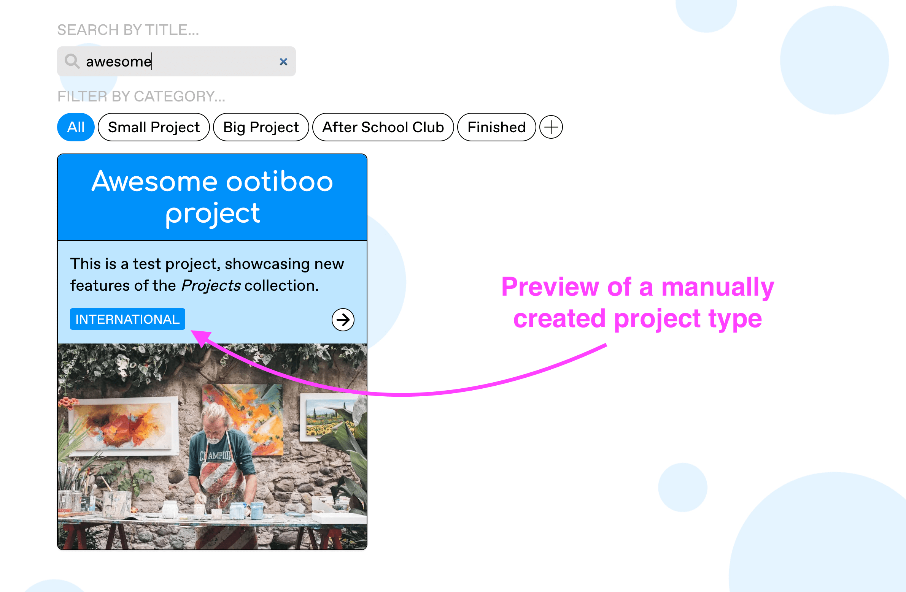

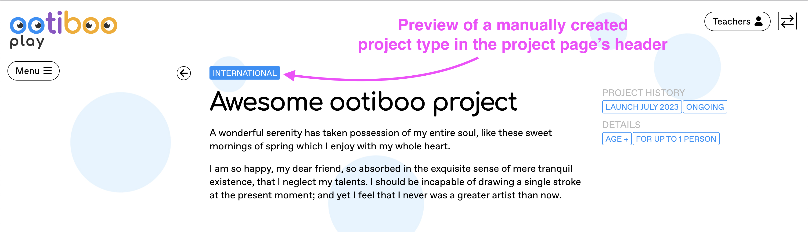

 

### *National Curriculum* and *Children’s University* Badges

Projects can now be displayed with a *National Curriculum* and a *Children’s University* badge.

Entries of the *Projects* collection feature a new *National Curriculum project?* and *Children's University project?* toggle. When either is set to *true*, the corresponding badge will be displayed on the project's card (Projects overview page).

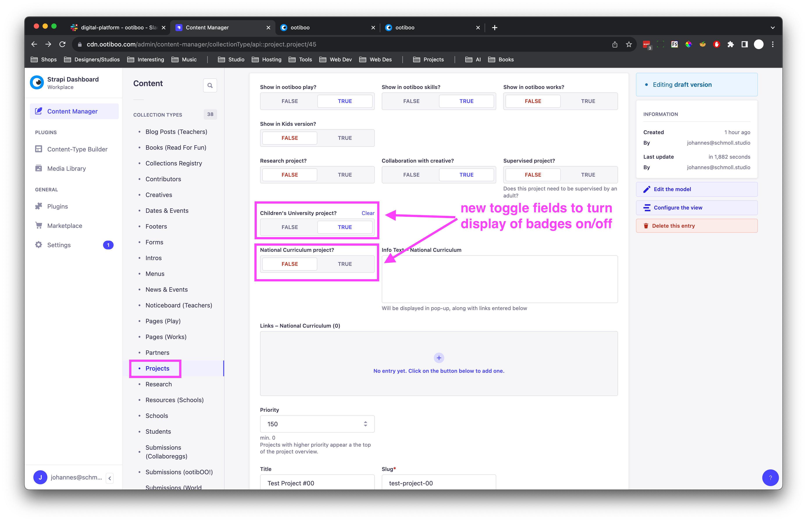

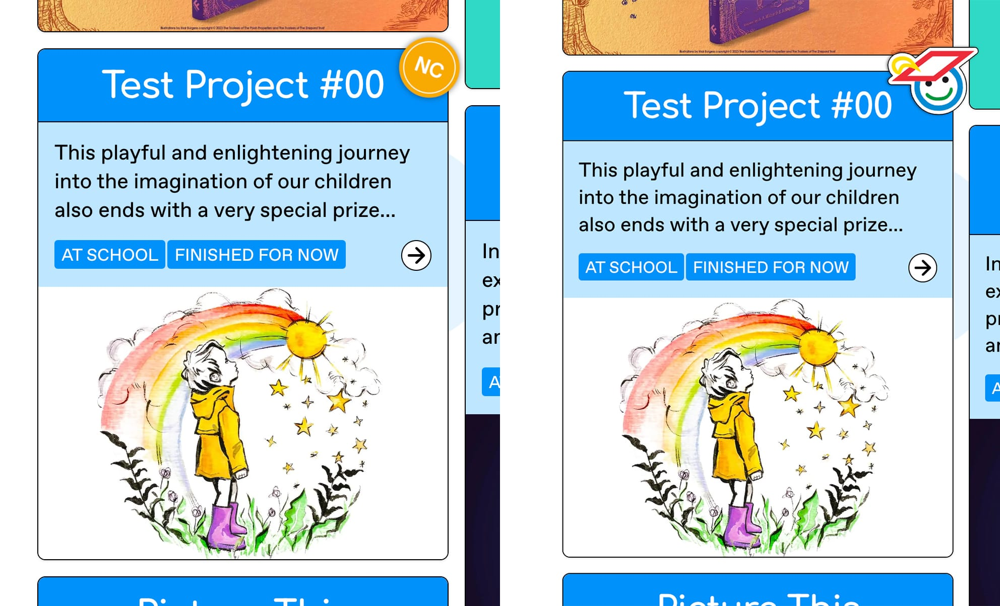

Additionally, project entries now feature a set of fields to provide additional information in regards to the project's affiliation with the National Curriculum: next to and below the *National Curriculum project?* toggle, an info text as well as a list of links can be entered. In the project page's header, the badge takes the form of a button, which when clicked opens a pop-up with the additional information.

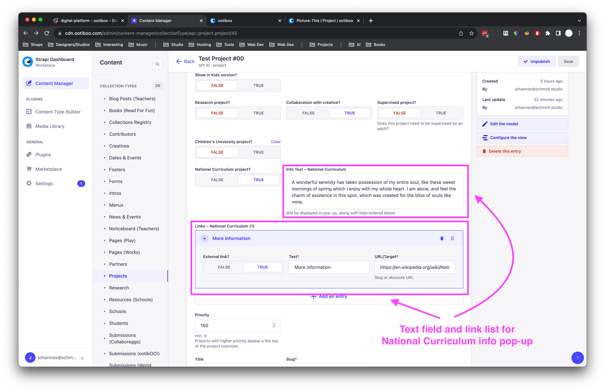
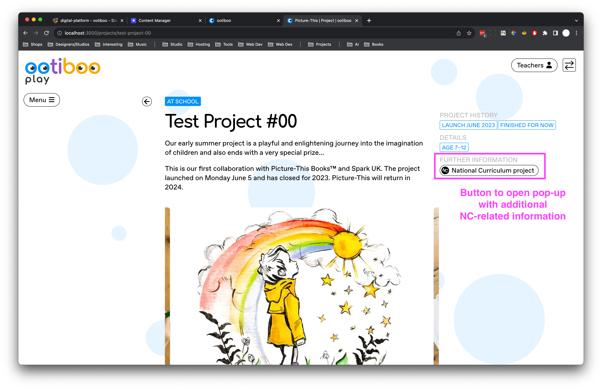

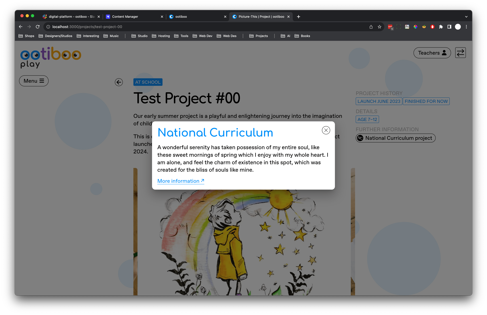

---

 

## 🧹 Cleanup 🧹

- All deprecated Strapi single content types for play.ootiboo.com pages have been archived. They have become obsolete since management of play.ootiboo-related pages has been moved to a more conveniently editable collection type
